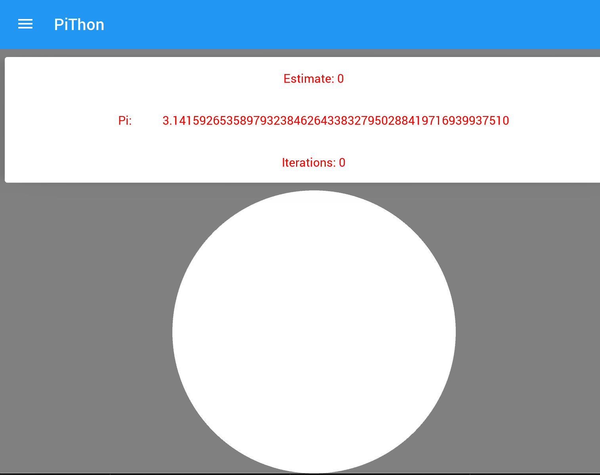

# ng-minesweeper
  


## Index ##

* [About](#about)
* [Setup](#setup)

## About
A hybrid mobile application written in Python with the Kivy framework in order to calculate Pi.

* Visit [my personal website](htts://jrquick.com) for more cool projects!

## Setup

### Install

#### Mac
`sudo pip install pygments docutils`
`brew install sdl2 sdl2_image sdl2_ttf sdl2_mixer gstreamer`

`pip install cython`
`pip install kivy`

`cd vendor/kivy-md && py setup.py install`

### Run 
    
`python main.py`

### Syntax Highlighting
#### IntelliJ
```bash
USE_OSX_FRAMEWORKS=0 pip3 install kivy
```

*Within IntelliJ: File->Import Settings->Select 'intellij-settings.jar'
